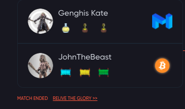

Let's look at March 22nds Omega tournament and the first battle.  https://arena.cryptocolosseum.com/tournament/1099528405024

Genghis Kate https://arena.cryptocolosseum.com/gladiator/9?faction=MTC vs 
John The Beast: https://arena.cryptocolosseum.com/gladiator/4?faction=BTC

The underlying mechanics of combat in Crypto Colosseum are fairly straightforward. A gladiator's Attack stat determines the maximum "attack roll," and the Defense stat determines maximum "defense roll". If the rolled attack exceeds the rolled defense, the attack is successful, and damage is dealt according to the difference (attack roll - defense roll). Otherwise, the defender blocks, and no damage is dealt.

Each battle is turn based. At the beginning of the battle, a coin is flipped to determine who attacks first. On each subsequent turn, a 3-sided dice is rolled to determine who is the attacker. The winner of the previous round (attacker or defender) has a 2/3 chance of being the attacker.  This enables gladiators to get on a roll and stage big comebacks.  A turn's attacker is sometimes referred to as having initiative.

Turns continue and attacks are repeated until one gladiator's health reaches zero or below, at which point the gladiator who still stands is declared the victor.

Items also play a large role in combat. In our example above, Genghis Kate has an Oil of Grinding attack, so she receives +100 on every attack roll she makes.

Some items have a chance of being used and a maximum number of uses, such as the **Elixir of Recovered Consensus**. This item can be used up to two times per battle, and has a 35% percent chance of being used each round.

JohnTheBeast is equipped with a **Curse of the Crypto King**, which is reduces defense by three hundred up to two times.

So that means up to 2 times per battle, he will have a chance of having his defense roll reduced by 300 (which lead to Kate dealing some truly massive damage during their battle). You can check out the odds of items activating in the table [here](/gamemechanics/items).

The last major component in combat is what faction a gladiator is fighting for.  We will cover that in the next installment.
