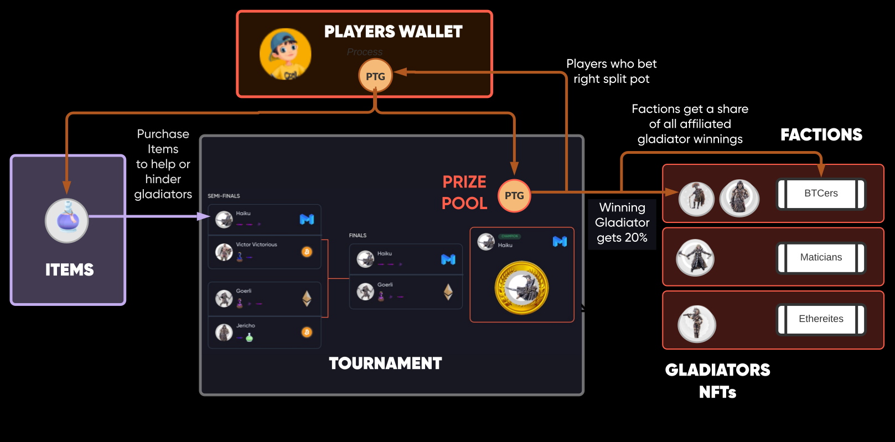
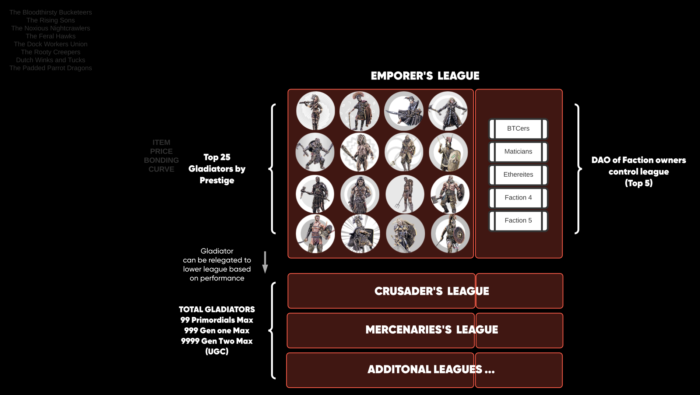

:::tip

This documentation is a work in progress.

:::

Here’s a walk through of PTG and how you can earn your way to emperor of the Arena.

* Gladiators battle in regular tournaments.
* Gladiators belong to factions (ETH, BTC, MATIC)
* The price movement of their faction affects the outcome of their matchup.
* Players bet on which gladiator will win.
* Players buy items which enhance (or hinder) a gladiator’s chance to win.
    * For example, increase attack or decrease defense.
* Players that bet correctly share in their pro-rata share of the entire pot (minus gladiator winnings).
* Gladiators win 5% of the betting pool (not including incentives).
* 25% of the gladiator’s winnings go to the Faction they fought in.
    * For example if a gladiator fought in a tournament with $PTG 100 at stake and won, the gladiator would receive $PTG 3.75 and the faction $PTG 1.25

Already we have an emergent multiplayer game with interesting psychological dynamics. Do I wait to bet big? Do I load up my gladiators with the maximum allowed items and then wait? Do I bet big and *then* come in and fill up items on other gladiators. Each tournament is like a giant game of bridge but instead of cards we have gory battles and AI-enhanced pre-battle taunting.

Everything in the game is a token. PTG is a token, the gladiators are NFTs, the items are NFTs, the Factions themselves are tokens which can be owned. Owners of factions may transfer PTG out of factions should they desire and owners of gladiator NFTs may also transfer out the gladiator’s PTG.

Betting lets players stack PTG and they only need a little luck (and a good ITEM strategy). Bonuses added to the prize pools will be larger earlier on and be reduced over time.  This gives the advantage to those that get in early.

Owning gladiator contracts or factions (or parts thereof) earns you passive PTG.  This is primarily done through staking PTG into a faction.  The earned PTG can then be used for buying bigger shares of existing factions, retaining the services of your own gladiator or even starting a new gladiator or faction and working them up through the laddering system.

The Arena is divided into leagues. At the time of this writing the only operating league is the Emperor’s league. This league is the top-echelon league with only the highest rated gladiators and factions competing. At any time only the top 25 gladiators and top 5 factions in terms of PTG holdings may participate in this league.

The league is implemented as a DAO with the factions as the voting members. The factions may mint new items which are only available for use within their league. These items are immediately placed into bonding curves (on Quickswap) vs PTG.  The funds generated by selling items are fed back into the prize purses, particularly for premium tournaments.

Clearly you want your gladiators and factions to participate in the highest league possible as this earns you larger and larger PTG rewards in a passive manner. This incentivizes you to lock up as much PTG as you can in order to keep increasing your bags.

Given the influence of chance and items on the outcome of battles and the fact that 75% of the purse is distributed to bettors, there is a strong chance that new players will be able to stack enough PTG to compete in the upper echelons. 
